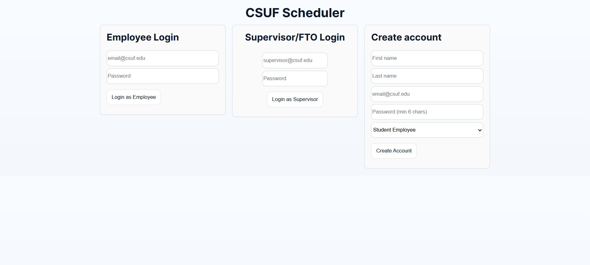
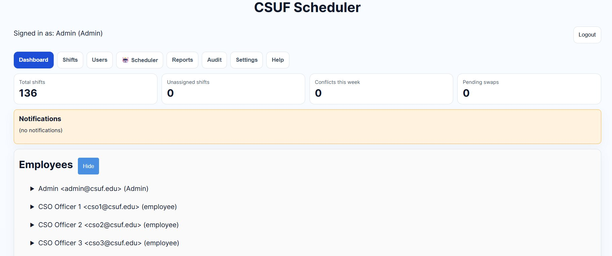
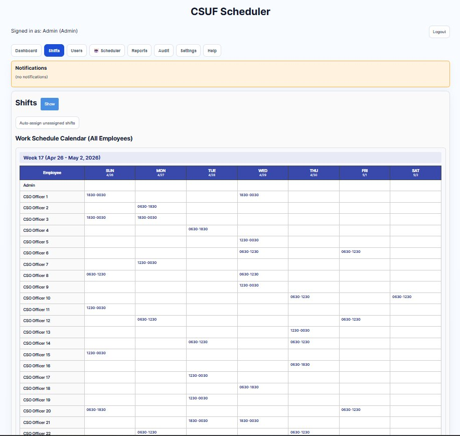
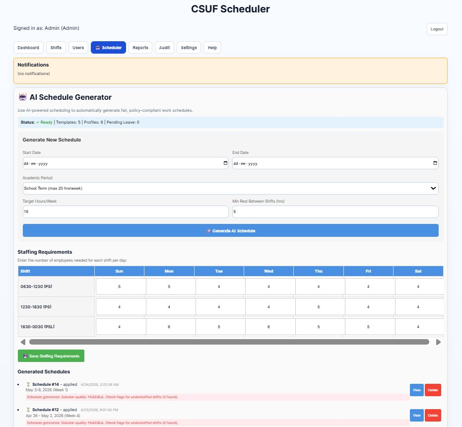
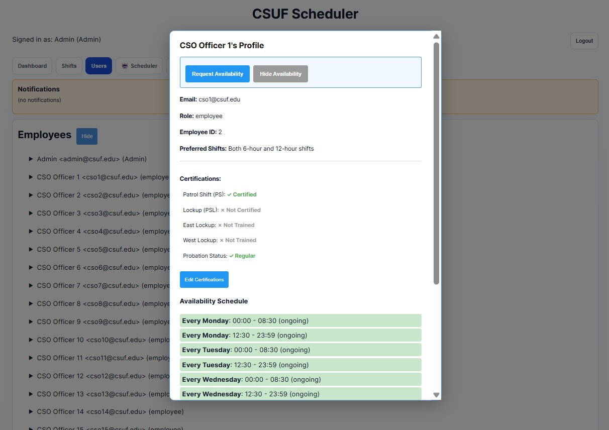
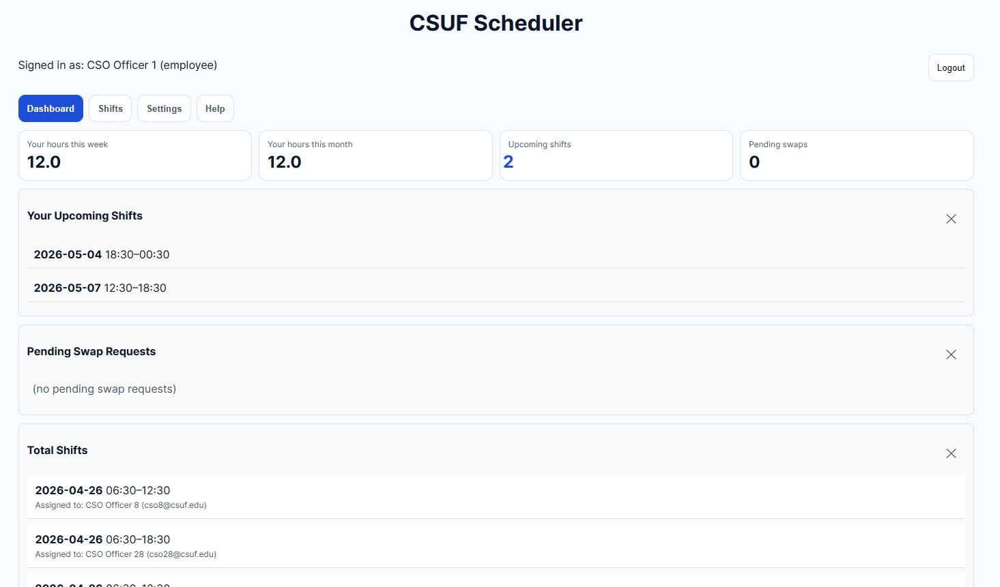
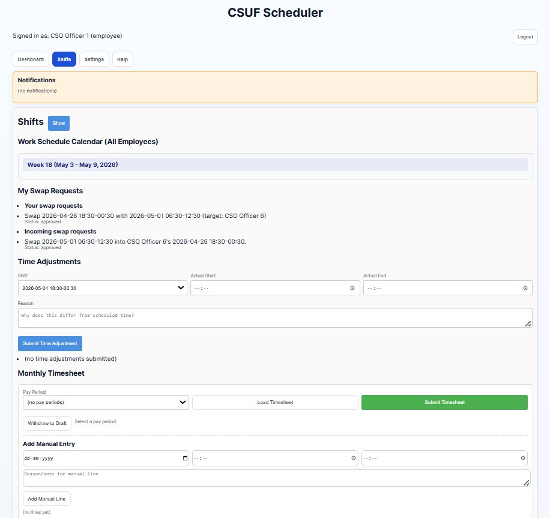

# CSUF Scheduler

A full-stack workforce scheduling platform for university student staff. Built with Flask, React Native/Expo, and Google OR-Tools to automate constraint-based schedule generation — cutting schedule creation from 4+ hours of manual work to under 30 seconds.


---

## The Problem

Scheduling 50+ student staff members across overlapping shifts, certification requirements, and availability windows was done manually with spreadsheets — taking supervisors 10+ hours per week and still producing conflicts. There was no audit trail, no swap workflow, and no way to enforce labor policies consistently.

## What This Builds

A production-grade scheduling platform where supervisors configure constraints once and the optimizer generates a policy-compliant schedule in seconds. Staff submit availability and swap requests through a mobile app; supervisors approve through the same interface. Every action is logged.

---

## Key Results

| Metric | Before | After |
|--------|--------|-------|
| Schedule generation time | 4+ hours (manual) | < 30 seconds |
| Schedule feasibility rate | ~70% (conflicts common) | 95%+ |
| Supervisor scheduling effort | Baseline | ~60% reduction |
| Constraint violations | Manual enforcement | Zero (hard constraints guaranteed) |

---

## Screenshots

### Role-based login
Three sign-in surfaces on one screen — Employee, Supervisor/FTO, and account creation.


### Admin dashboard
Stat cards (total shifts, unassigned, conflicts, pending swaps) and the full employee roster.


### Weekly shift calendar
Every officer's assignments across all seven days, with one-click auto-assign for open slots.


### AI schedule generator (OR-Tools CP-SAT)
Set the date range, academic period, and per-shift staffing needs; the CP-SAT solver returns a feasible, conflict-free draft to review.


### Employee profile & availability
Certifications, probation status, shift preferences, and recurring availability that feed the optimizer.


### Employee dashboard
Personal hours, upcoming shifts, and pending swap requests at a glance.


### Swaps, time adjustments & timesheets
Self-service swap requests, time-adjustment submissions, and the monthly timesheet — all in one view.


---

## Optimization Approach

The scheduling engine (`backend/app/services/scheduler/engine.py`) uses the **Google OR-Tools CP-SAT solver** — a constraint programming model over Boolean decision variables.

```
assignments[(employee_id, date, template_id)] ∈ {0, 1}
```

**Hard constraints** (always satisfied):
- Employee availability windows (submitted per day)
- Maximum weekly hours per employee
- Minimum rest hours between consecutive shifts
- Patrol/lockup certification requirements
- Approved leave exclusions
- Trainee–FTO pairing rules

**Soft constraints** (minimized in objective function):
- Fair hour distribution across all employees (weighted penalty ×1000)
- Workload rotation to prevent the same staff covering every weekend
- Understaffed shift minimization

The solver returns `OPTIMAL` or `FEASIBLE` status; infeasible slots are flagged with the specific constraint that blocked assignment.

---

## Tech Stack

| Layer | Technology |
|-------|-----------|
| Backend API | Flask, SQLAlchemy, Alembic, Flask-Login, Flask-WTF (CSRF) |
| Optimization | Google OR-Tools CP-SAT |
| Database | PostgreSQL (production), SQLite (local dev) |
| Mobile client | React Native, Expo SDK |
| Auth | Session-based with role-based access control |
| Deployment | Render (backend + DB), Docker Compose, GitHub Actions |

---

## Architecture

```
csuf-scheduler/
├── backend/
│   ├── app/
│   │   ├── models/          # SQLAlchemy models (User, Shift, Availability, ...)
│   │   ├── routes/          # Flask blueprints per domain
│   │   ├── services/
│   │   │   └── scheduler/
│   │   │       └── engine.py   # OR-Tools CP-SAT scheduling engine
│   │   └── __init__.py      # App factory
│   ├── alembic/             # Database migrations
│   └── requirements.txt
├── mobile/                  # Expo / React Native app
│   ├── app/                 # Screen components (Expo Router)
│   └── components/
├── frontend/                # Optional web dashboard
├── scripts/                 # Dev and deployment helpers
├── docs/                    # Architecture, schema, engineering decisions
└── tests/                   # pytest suite
```

**Role hierarchy:** `admin` → `supervisor` → `FTO` → `student/trainee`

Each role sees a scoped view: admins manage the system, supervisors generate/approve schedules, FTOs are paired with trainees, students submit availability and swap requests.

---

## Local Setup

### Prerequisites

- Python 3.11+
- Node.js 18+ and npm
- (Optional) PostgreSQL — SQLite works out of the box for local dev

### Backend

```bash
# 1. Create and activate a virtual environment
python -m venv .venv
# Windows:
.venv\Scripts\activate
# macOS/Linux:
source .venv/bin/activate

# 2. Install dependencies
pip install -r backend/requirements-dev.txt

# 3. Configure environment
cp backend/.env.example backend/.env
# Edit backend/.env — set DATABASE_URL and SECRET_KEY

# 4. Run database migrations
cd backend
flask db upgrade

# 5. Start the dev server
cd ..
python scripts/run_dev.py
```

Backend runs at `http://localhost:5000` · Swagger UI at `http://localhost:5000/apidocs/`

### Mobile App

```bash
cd mobile
npm install
npx expo start --localhost
```

Scan the QR code with Expo Go, or press `w` for browser preview. Set `EXPO_PUBLIC_API_URL` in `mobile/.env` to point at your backend.

---

## Generating a Schedule

1. Log in as `supervisor` or `admin`
2. Navigate to **Schedule Config** and set the date range, shift templates, and max weekly hours
3. Tap **Generate** — the CP-SAT solver runs and returns a schedule within seconds
4. Review flagged shifts (understaffed slots with the blocking constraint shown)
5. Tap **Apply** to publish the schedule to all staff

---

## Running Tests

```bash
pytest -q
```

Linting:

```bash
black --check backend
isort --check-only backend
flake8 backend/app
```

---

## Deployment

The project ships with a `render.yaml` for one-click Render deployment and a `docker-compose.prod.yml` for self-hosted setups.

See [`DEPLOYMENT.md`](DEPLOYMENT.md) for environment variable reference, migration steps, and rollback procedures.

---

## Documentation

- [`API_REFERENCE.md`](API_REFERENCE.md) — all endpoints with request/response shapes
- [`DEPLOYMENT.md`](DEPLOYMENT.md) — production deploy guide
- [`DEVELOPMENT.md`](DEVELOPMENT.md) — local dev workflow and conventions
- [`MONITORING.md`](MONITORING.md) — health checks and alerting
- [`docs/`](docs/) — database schema, engineering decisions, architecture diagrams

---

## About

Built as a capstone project for CSUF, replacing a manual spreadsheet-based process used by the university's student workforce scheduling team.
